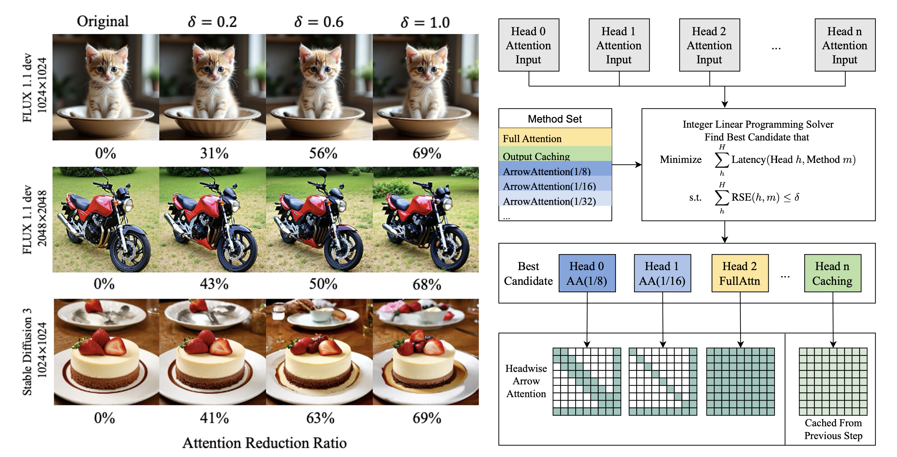

# DiTFastAttnV2: Head-wise Attention Compression for Multi-Modality Diffusion Transformers

<a href="https://arxiv.org/abs/2503.22796">
  
</a>




# Install

```
conda create -n speedupdit python=3.12
```

install torch 2.5.1

```
pip install numpy packaging matplotlib scikit-image ninja torchvision
pip install git+https://github.com/huggingface/diffusers
pip install thop pytorch_fid torchmetrics accelerate torchmetrics[image] beautifulsoup4 ftfy transformers SentencePiece
```

# Install DiTFastAttnV2 Fused Kernel

https://github.com/changdong1687/dfav2_fused_kernel


# Usage

Please see `sd3_generation.py` and `flux_generation.py` for a quick start.

```
python sd3_generation.py
```

```
python flux_generation.py
```

# TODO
- [ ] release scripts and kernels that support more patterns include arrow attention with residual sharing and half arrow attention
- [ ] extend and support for video generation (CogVideoX, HunyuanVideo, Wan2.1, etc)
